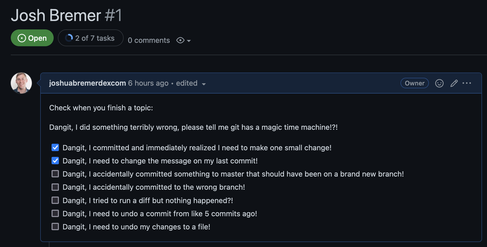

# Git 201: Crap I made a mistake!

Welcome! If you're here, you're ready to learn about how to clean up and fix all the inevitable mistakes you make in Git every day. Let's get started!

## How do I get started on this?

1. Fork this repository. Click "Fork" in the upper right.

2. Create an issue with your name. [Click here to create one](https://github.com/joshuabremerdexcom/Git-201-Crap-I-made-a-mistake/issues/new?assignees=&labels=&template=scorecard-for-training.md&title=).




3. Use the checklist created in the issue to go through the exercises below!

## Exercises

### Table of Contents

* [Dangit, I committed and immediately realized I need to make one small change!](#dangit-i-committed-and-immediately-realized-i-need-to-make-one-small-change)
* [Dangit, I need to change the message on my last commit!](#dangit-i-need-to-change-the-message-on-my-last-commit)
* [Dangit, I accidentally committed something to main that should have been on a brand new branch!](#dangit-i-accidentally-committed-something-to-main-that-should-have-been-on-a-brand-new-branch)
* [Dangit, I accidentally committed to the wrong branch!](#dangit-i-tried-to-run-a-diff-but-nothing-happened)
* [Dangit, I tried to run a diff but nothing happened?!](#dangit-i-accidentally-committed-to-the-wrong-branch)
* [Dangit, I need to undo a commit from like 5 commits ago!](#dangit-i-need-to-undo-a-commit-from-like-5-commits-ago)
* [Dangit, I need to undo my changes to a file!](#dangit-i-need-to-undo-my-changes-to-a-file)
* [Dangit, I did something terribly wrong, please tell me git has a magic time machine!?!](#dangit-i-did-something-terribly-wrong-please-tell-me-git-has-a-magic-time-machine)

### Dangit, I committed and immediately realized I need to make one small change!

```sh
# make your change
git add . # or add individual files
git commit --amend --no-edit
# now your last commit contains that change!
# WARNING: never amend public commits
```

This usually happens to me if I commit, then run tests/linters... and ugh, I didn't put a space after an equals sign. You could also make the change as a new commit and then do `git rebase -i` in order to squash them both together, but this is about a million times faster.

_Warning: Avoid amending commits that have been pushed up to a public/shared branch. Otherwise people will be confused if they have pulled your branch, and then the commit is missing._

#### Lesson

Set up your system for the lesson by running the following:

```sh
git checkout -b "Dangit-I-committed-and-immediately-realized-I-need-to-make-one-small-change"
echo "Hello Dexcm" > hello.txt
git add hello.txt
git commit -m "Added new welcoming text file"
```

Crap, we mispelled Dexcom. Can you fix it inside that file and amend the commit?

Let's pretend that you needed b.txt restored. How would you do that? Can you restore that to your filesystem?

#### Deeper Dive

Want to learn more about amending?

* [Git documentation for undoing things](https://git-scm.com/book/en/v2/Git-Basics-Undoing-Things)
* [Detailed Discussion of git commit --amend (Atlassian)](https://www.atlassian.com/git/tutorials/rewriting-history)

### Dangit, I need to change the message on my last commit!

```sh
git commit --amend
# follow prompts to change the commit message
```

#### Lesson

Set up your system for the lesson by running the following:

```sh
git checkout -b "Dangit-I-committed-and-immediately-realized-I-need-to-make-one-small-change"
echo "Hello Dexcom" > password-in-commit.txt
git add password-in-commit.txt
git commit -m "Added file to tell people nxcv09xv980klasdnm"
```

Oh no, you put your password inside your commit! Can you amend your commit quickly before you push it up?

#### Deeper Dive

Want to learn more about amending?

* [Git documentation for undoing things](https://git-scm.com/book/en/v2/Git-Basics-Undoing-Things)
* [Detailed Discussion of git commit --amend (Atlassian)](https://www.atlassian.com/git/tutorials/rewriting-history)

### Dangit, I accidentally committed something to main that should have been on a brand new branch!

```sh
# create a new branch from the current state of main
git branch some-new-branch-name
# reset your main branch to the same commit on origin (Github)
git reset origin/main --hard
git checkout some-new-branch-name
# your commit lives in this branch now :)
```

#### Lesson

Set up your system for the lesson by running the following:

```sh
git checkout main
echo "Hello Dexcom" > accidental-commit-to-main.txt
git add accidental-commit-to-main.txt
git commit -m "Added hello file"
```

Can you get your main branch back to the same commit as Github is on? Can you make a new branch with your change without copy and paste?

#### Deeper Dive

Want to learn more about reset?

* [Git documentation for reset](https://git-scm.com/docs/git-reset)
* [Detailed Discussion of git reset (Atlassian)](https://www.atlassian.com/git/tutorials/undoing-changes/git-reset)

### Dangit, I accidentally committed to the wrong branch!

```sh
# undo the last commit, but leave the changes available
git reset HEAD~ --soft
git stash
# move to the correct branch
git checkout name-of-the-correct-branch
git stash pop
git add . # or add individual files
git commit -m "your message here"
# now your changes are on the correct branch
```

A lot of people have suggested using `cherry-pick` for this situation too, so take your pick on whatever one makes the most sense to you!

#### Lesson

Set up your system for the lesson by running the following:

```sh
git branch wrong-branch
git branch right-branch
git checkout wrong-branch
echo "Hello Dexcom" > commit-to-wrong-branch.txt
git add commit-to-wrong-branch.txt
git commit -m "Added hello file"
```

Can you "move" this commit over to the right branch? Can you remove the commit from the wrong branch and put the code inside the right branch?

#### Deeper Dive

Want to learn more about reset?

* [Git documentation for stash](https://git-scm.com/docs/git-stash)
* [Detailed Discussion of git stash (Atlassian)](https://www.atlassian.com/git/tutorials/saving-changes/git-stash)

### Dangit, I tried to run a diff but nothing happened?!

If you know that you made changes to files, but `diff` is empty, you probably `add`\-ed your files to staging and you need to use a special flag.

```sh
git diff --staged
```

File under ¯\\\_(ツ)\_/¯ (yes, I know this is a feature, not a bug, but it's baffling and non-obvious the first time it happens to you!)

#### Lesson

Set up your system for the lesson by running the following:

```sh
echo "Hello Dexcom" > where_is_my_diff.txt
git add commit-to-wrong-branch.txt
```

Can you show in your terminal what changed?

#### Deeper Dive

Want to learn more about diff?

* [Git documentation for diff](https://git-scm.com/docs/git-difftool)

### Dangit, I need to undo a commit from like 5 commits ago!

```sh
# find the commit you need to undo
git log
# use the arrow keys to scroll up and down in history
# once you've found your commit, save the hash
git revert [saved hash]
# git will create a new commit that undoes that commit
# follow prompts to edit the commit message
# or just save and commit
```

Turns out you don't have to track down and copy-paste the old file contents into the existing file in order to undo changes! If you committed a bug, you can undo the commit all in one go with `revert`.

You can also revert a single file instead of a full commit! But of course, in true git fashion, it's a completely different set of commands...

#### Lesson

Set up your system for the lesson by running the following:

```sh
echo 'foo' > a.txt && git add . && git commit -am "Added a.txt file"
echo 'bar' > b.txt && git add . && git commit -am "Added b.txt file"
echo 'baz' > c.txt && git add . && git commit -am "Added c.txt file"
echo 'qux' > c.txt && git add . && git commit -am "Added d.txt file"
```

You pushed this up yesterday and people are using this code. How can you remove `a.txt` and `b.txt` in the branch and not rewrite the history?

#### Deeper Dive

Want to learn more about revert?

* [Git documentation for revert](https://git-scm.com/docs/git-revert)
* [Detailed Discussion of git revert (Atlassian)](https://www.atlassian.com/git/tutorials/undoing-changes)

### Dangit, I need to undo my changes to a file!

```sh
# find a hash for a commit before the file was changed
git log
# use the arrow keys to scroll up and down in history
# once you've found your commit, save the hash
git checkout [saved hash] -- path/to/file
# the old version of the file will be in your index
git commit -m "Wow, you don't have to copy-paste to undo"
```

When I finally figured this out it was HUGE. HUGE. H-U-G-E. But seriously though, on what planet does `checkout --` make sense as the best way to undo a file?

#### Lesson

Set up your system for the lesson by running the following:

```sh
echo 'foo' > a.txt && git add . && git commit -am "Added a.txt file"
echo 'bar' > a.txt && git add . && git commit -am "Updated a.txt file"
echo 'baz' > a.txt && git add . && git commit -am "Updated a.txt file"
echo 'qux' > a.txt && git add . && git commit -am "Updated a.txt file"
```

Can you change the contents of `a.txt` to `bar` by using `git checkout`?

#### Deeper Dive

Want to learn more about checkout?

* [Git documentation for checkout](https://git-scm.com/docs/git-checkout)
* [Detailed Discussion of git checkout (Atlassian)](https://www.atlassian.com/git/tutorials/undoing-changes)

### Dangit, I did something terribly wrong, please tell me git has a magic time machine!?!

```sh
git reflog
# you will see a list of every thing you've
# done in git, across all branches!
# each one has an index HEAD@{index}
# find the one before you broke everything
git reset HEAD@{index}
# magic time machine
```

You can use this to get back stuff you accidentally deleted, or just to remove some stuff you tried that broke the repo, or to recover after a bad merge, or just to go back to a time when things actually worked. I use `reflog` A LOT. Mega hat tip to the many many many many many people who suggested adding it!

#### Lesson

Run the following shell script that will make 4 commits and remove the commits:

```sh
CURRENT_HEAD=$(git rev-parse HEAD)
echo 'foo' > a.txt && git add . && git commit -am "Added a.txt file" && git reset --hard $CURRENT_HEAD;
echo 'bar' > b.txt && git add . && git commit -am "Added b.txt file" && git reset --hard $CURRENT_HEAD;
echo 'baz' > c.txt && git add . && git commit -am "Added c.txt file" && git reset --hard $CURRENT_HEAD;
echo 'qux' > c.txt && git add . && git commit -am "Added d.txt file" && git reset --hard $CURRENT_HEAD;
```

Let's pretend that you needed b.txt restored. How would you do that? Can you restore that to your filesystem?

#### Deeper Dive

Want to learn more about reflog?

* [Git documentation for reflog](https://git-scm.com/docs/git-reflog)
* [Detailed Discussion of the git reflog command (Atlassian)](https://www.atlassian.com/git/tutorials/rewriting-history/git-reflog)

